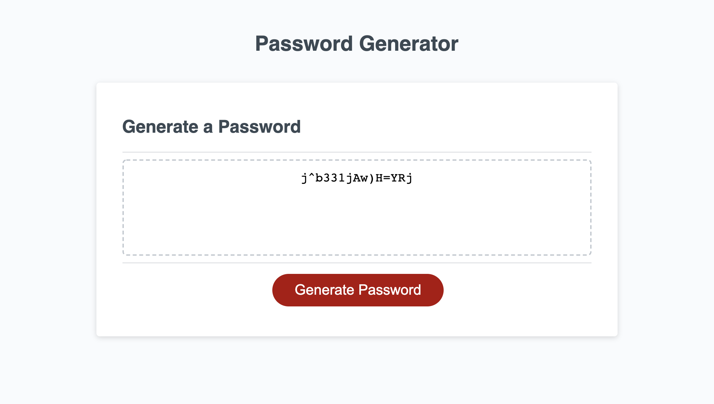
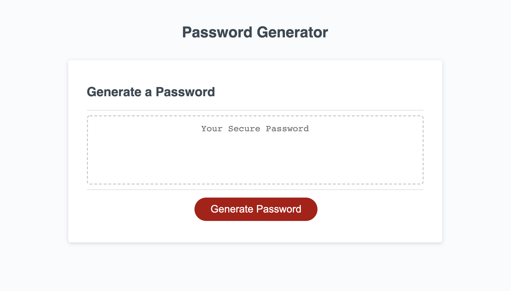

# PasswordGenerator

For this assignment, I created a secure Password Generator. The password generator will generate a password between 8 and 128 characters long and may contain upper and lowercase letters, special characters, and numbers. The length and character types are chosen by the user. By clicking the generate password button and following some prompts, a random, secure password is generated. 

Deployed Application: https://albie140.github.io/PasswordGenerator/

Technologies Used:
HTML, CSS, JavaScript

